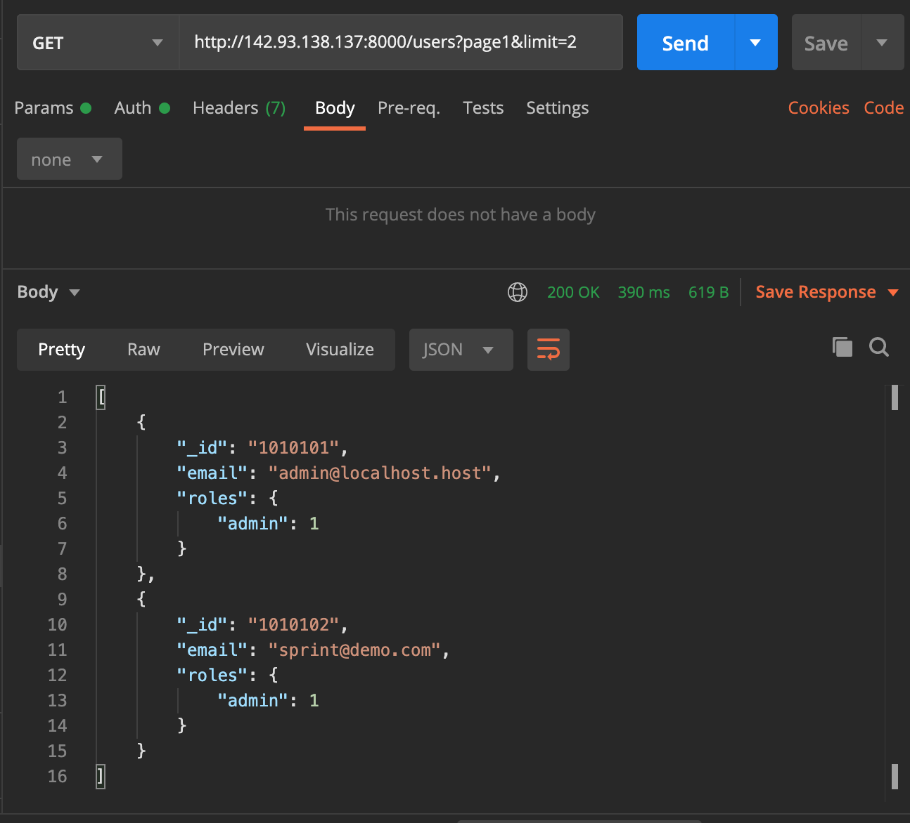
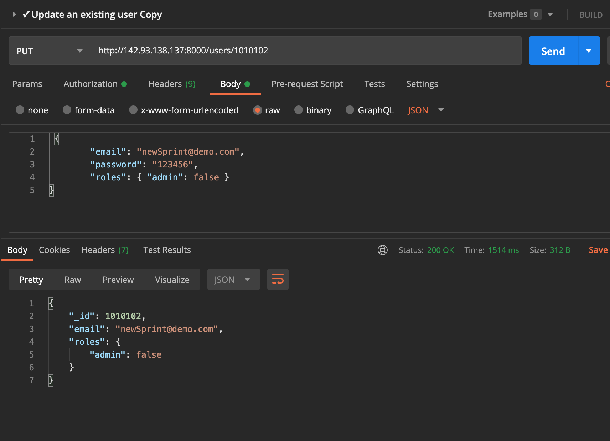
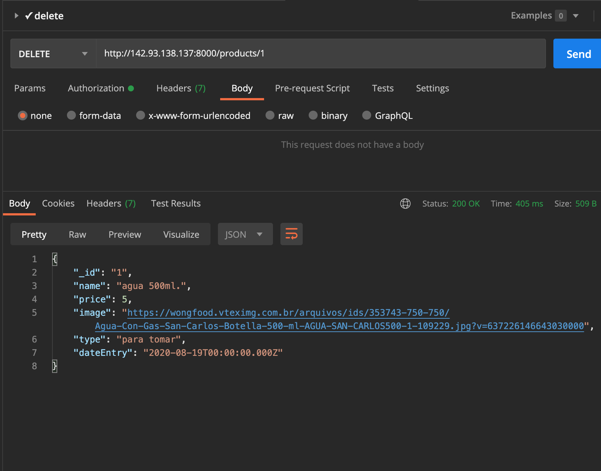
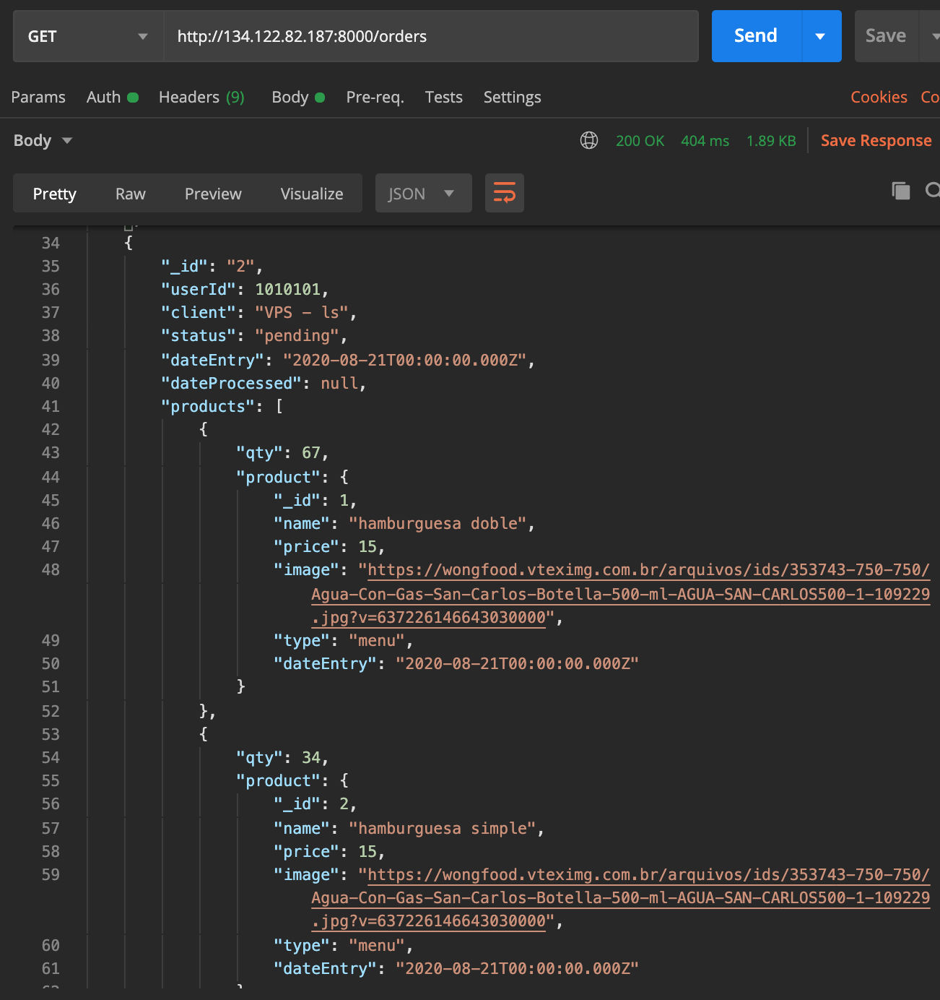
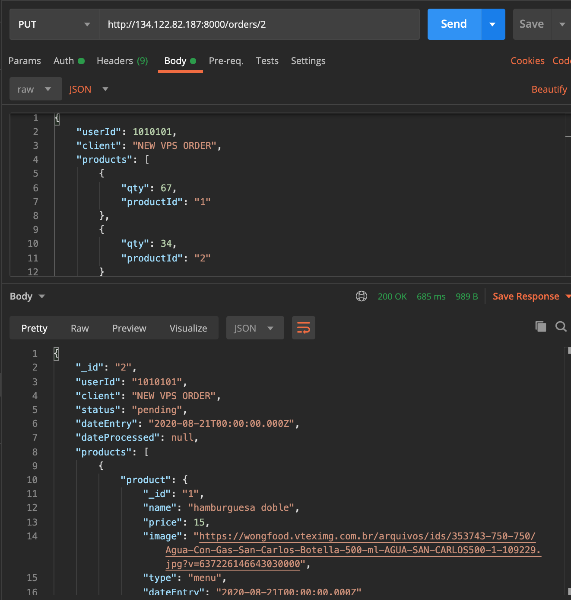

# Burger Queen - API con Node.js y MySql server

Link desplegado : (http://142.93.138.137:8000/)

## Índice

* [1. Preámbulo](#1-pre%C3%A1mbulo)
* [2. Resumen del proyecto](#2-resumen-del-proyecto)
* [3. Objetivos de aprendizaje](#3-objetivos-de-aprendizaje)
* [4. Consideraciones generales](#4-consideraciones-generales)
* [5. Criterios de aceptación mínimos del proyecto](#5-criterios-de-aceptaci%C3%B3n-m%C3%ADnimos-del-proyecto)
* [6. Pistas, tips y lecturas complementarias](#6-pistas-tips-y-lecturas-complementarias)
* [7 HTTP API Checklist](#7-http-api-checklist)

## 1. Preámbulo

Un pequeño restaurante de hamburguesas, que está creciendo, necesita un
sistema a través del cual puedan tomar pedidos usando una _tablet_, y enviarlos
a la cocina para que se preparen ordenada y eficientemente.

Este proyecto tiene dos áreas: interfaz (cliente) y API (servidor). Nuestra
clienta nos ha solicitado desarrollar la API que se debe integra con la
interfaz,  que otro equipo de desarrolladoras está trabajando
simultáneamente.

## 2. Resumen del proyecto

Con una API en este caso nos referimos a un _servidor web_, que es
básicamente un programa que _escucha_ en un puerto de red, a través del cual
podemos enviarle _consultas_ (_request_) y obtener _respuestas_ (_response_).

Un servidor web debe _manejar_ consultas entrantes y producir respuestas a esas
consultas que serán enviadas de vuelta al _cliente_. Cuando hablamos de
_aplicaciones de servidor_, esto implica una arquitectura de _cliente/servidor_,
donde el cliente es un programa que hace consultas a través de una red (por
ejemplo el navegador, cURL, ...), y el _servidor_ es el programa que recibe
estas consultas y las responde.

[Node.js](https://nodejs.org/) nos permite crear servidores web super eficientes
de manera relativamente simple y todo esto usando JavaScript.

Para desarrollar la API rest utilizamos Nodejs y Express, lo complementamos con un motor de base de datos mysql.
y para automatizar el despliegue de aplicaciones dentro de contenedores de software
usamos docker.

La clienta nos ha dado un [link a la documentación](https://laboratoria.github.io/burger-queen-api/)
que especifica el comportamiento esperado de la API que expondremos por
HTTP.

## 3. Objetivos de aprendizaje

El objetivo principal de aprendizaje es adquirir experiencia con **Node.js**
como herramienta para desarrollar _aplicaciones de servidor_, junto con una
serie de herramientas comunes usadas en este tipo de contexto (Express como
framework, MongoDB o MySQL como base datos, contenedores de docker, servidores
virtuales, etc).

En este proyecto tendrás que construir un servidor web que debe _servir_ `JSON`
sobre `HTTP`, y desplegarlo en un servidor en la nube.

Para completar el proyecto tendrás que familiarizarte con conceptos como
**rutas** (_routes_), **URLs**, **HTTP** y **REST** (verbs, request, response, headers,
body, status codes...), **JSON**, **JWT** (_JSON Web Tokens_), **conexión con
una base datos** ( `MySQL`), **variables de entorno**, **deployment**,
**contenedores de `docker`**...

## 4. Consideraciones generales

* La lógica del proyecto está implementada completamente en JavaScript (ES6).
En este proyecto está permitido usar librerías o frameworks, asi como
extensiones al lenguaje con `babel` (caso en el cual deberás incluir un
comando `npm build`).

* Los tests deben cubren un mínimo del 90% de _statements_, _functions_,
_lines_ y _branches_. Si bien el boilerplate no incluye la configuración para
pruebas unitarias, estas son obligatorias.

* Otro requerimiento del equipo de QA de nuestra clienta fue realizar
**pruebas _end-to-end_**, que usamos para verificar el comportamiento desde el
punto de vista de HTTP, desde afuera del servidor. Estos tests, a diferencia de
las pruebas unitarias, no prueban cada pieza por separado sino que prueban la
aplicación completa, de principio a fin. Estas pruebas, al no hacer uso directo
del código fuente de la aplicación, pueden ejecutarse directamente sobre una URL
remota, ya que la interfaz sometida a pruebas es HTTP.
o
### 5.1 API

Según lo establecido por la [documentación](https://laboratoria.github.io/burger-queen-api/)
entregada por nuestra clienta, la API debe exponer los siguientes endpoints:

#### 5.1,1 `/`

* `GET /`

#### 5.1.2 `/auth`

* `POST /auth`

#### 5.1.3 `/users`

* `GET /users`
* `GET /users/:uid`
* `POST /users`
* `PUT /users/:uid`
* `DELETE /users/:uid`

#### 5.1.4 `/products`

* `GET /products`
* `GET /products/:productid`
* `POST /products`
* `PUT /products/:productid`
* `DELETE /products/:productid`

#### 5.1.5 `/orders`

* `GET /orders`
* `GET /orders/:orderId`
* `POST /orders`
* `PUT /orders/:orderId`
* `DELETE /orders/:orderId`

